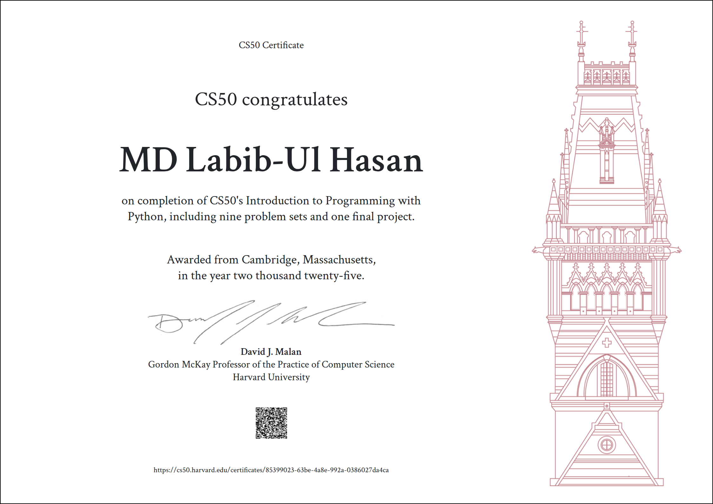

 

<h1 align="center">
Harvard CS50’s Introduction to Programming with Python — CS50P 2022
</h1>

### These are my solutions for CS50's Introduction to Programming with Python 2022.
### Final Project: [Student Information Management System](https://youtu.be/8PWYQKZ0h24)

### ⚠️ Disclaimer
**The following code is provided solely for educational reference and is not intended to be submitted as your own work.
Submitting work that is not your own violates the course’s [Academic Honesty](https://cs50.harvard.edu/python/2022/honesty/) policy and undermines your own learning.**

## Table of Contents
### [Week 0](/Week%200/) - [Functions, Variables](https://cs50.harvard.edu/python/2022/weeks/0/)
- [Indoor Voice](/Week%200/Indoor%20Voice)
- [Playback Speed](/Week%200/Playback%20Speed)
- [Making Faces](/Week%200/Making%20Faces)
- [Einstein](/Week%200/Einstein)
- [Tip Calculator](/Week%200/Tip%20Calculator)

### [Week 1](/Week%201/) - [Conditionals](https://cs50.harvard.edu/python/2022/weeks/1/)
- [Deep Thought](/Week%201/Deep%20Thought)
- [Home Federal Savings Bank](/Week%201/Home%20Federal%20Savings%20Bank)
- [File Extensions](/Week%201/File%20Extensions)
- [Math Interpreter](/Week%201/Math%20Interpreter)
- [Meal Time](/Week%201/Meal%20Time)

### [Week 2](/Week%202/) - [Loops](https://cs50.harvard.edu/python/2022/weeks/2/)
- [camelCase](/Week%202/Camel%20Case)
- [Coke Machine](/Week%202/Coke%20Machine)
- [Just setting up my twttr](/Week%202/Just%20setting%20up%20my%20twttr)
- [Vanity Plates](/Week%202/Vanity%20Plates)
- [Nutrition Facts](/Week%202/Nutrition%20Facts)

### [Week 3](/Week%203/) - [Exceptions](https://cs50.harvard.edu/python/2022/weeks/3/)
- [Fuel Gauge](/Week%203/Fuel%20Gauge)
- [Felipe's Taqueria](/Week%203/Felipe's%20Taqueria)
- [Grocery List](/Week%203/Grocery%20List)
- [Outdated](/Week%203/Outdated)

### [Week 4](/Week%204/) - [Libraries](https://cs50.harvard.edu/python/2022/weeks/4/)
- [Emojize](/Week%204/Emojize)
- [Frank, Ian and Glen's Letters](/Week%204/Frank%2C%20Ian%20and%20Glen's%20Letters)
- [Adieu, Adieu](/Week%204/Adieu%2C%20Adieu)
- [Guessing Game](/Week%204/Guessing%20Game)
- [Little Professor](/Week%204/Little%20Professor)
- [Bitcoin Price Index](/Week%204/Bitcoin%20Price%20Index)

### [Week 5](/Week%205/) - [Unit Tests](https://cs50.harvard.edu/python/2022/weeks/5/)
- [Testing my twttr](/Week%205/Testing%20my%20twittr)
- [Back to the Bank](/Week%205/Back%20to%20the%20Bank)
- [Re-requesting a Vanity Plate](/Week%205/Re-requesting%20a%20Vanity%20Plate)
- [Refueling](/Week%205/Refueling)

### [Week 6](/Week%206/) - [File I/O](https://cs50.harvard.edu/python/2022/weeks/6/)
- [Lines of Code](/Week%206/Lines%20of%20Code)
- [Pizza Py](/Week%206/Pizza%20Py)
- [Scourgify](/Week%206/Scourgify)
- [CS50 P-Shirt](/Week%206/CS50%20P-Shirt)

### [Week 7](/Week%207/) - [Regular Expressions](https://cs50.harvard.edu/python/2022/weeks/7/)
- [NUMB3RS](/Week%207/NUMB3RS)
- [Watch on YouTube](/Week%207/Watch%20on%20YouTube)
- [Working 9 to 5](/Week%207/Working%209%20to%205)
- [Regular, um, Expressions](/Week%207/Regular%2C%20um%2C%20Expressions)
- [Response Validation](/Week%207/Response%20Validation)

### [Week 8](/Week%208/) - [Object-Oriented Programming](https://cs50.harvard.edu/python/2022/weeks/8)
- [Seasons of Love](/Week%208/Seasons%20of%20Love)
- [Cookie Jar](/Week%208/Cookie%20Jar)
- [CS50 Shirtificate](/Week%208/CS50%20Shirtificate)

### [Final Project](/Final%20Project) - [Final Project Link](https://cs50.harvard.edu/python/2022/project/)
- [Final Project](/Final%20Project/Final%20Project)
